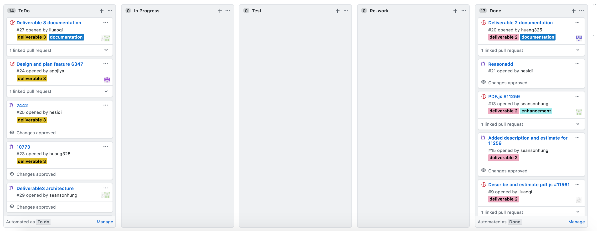
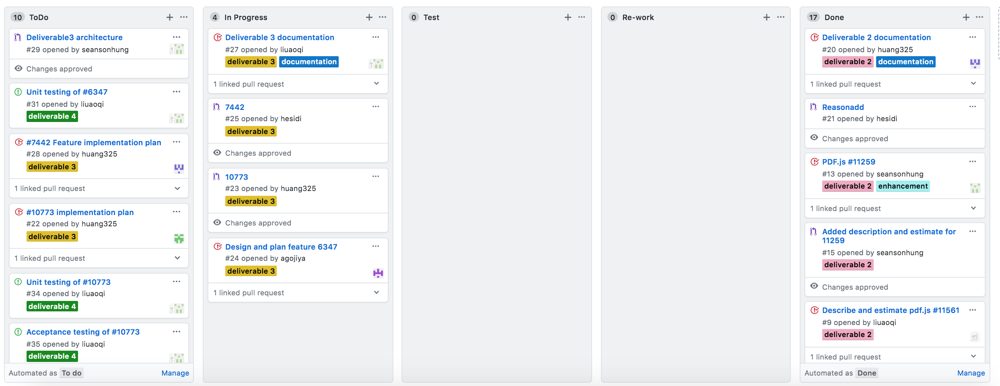
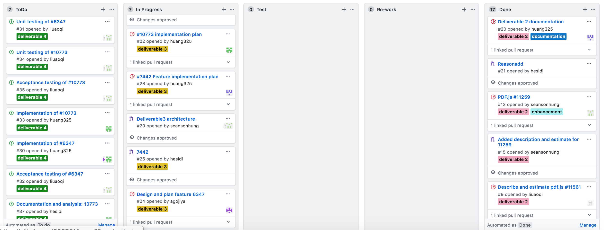
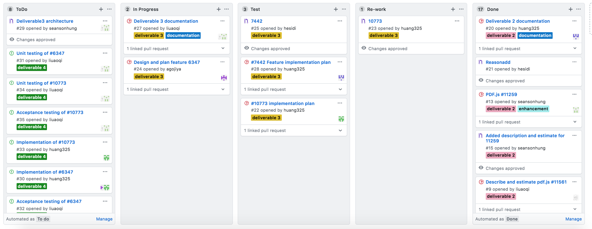
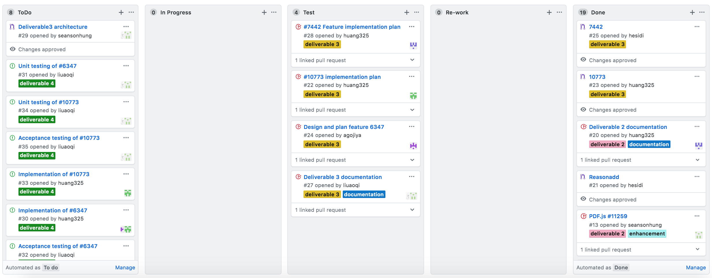
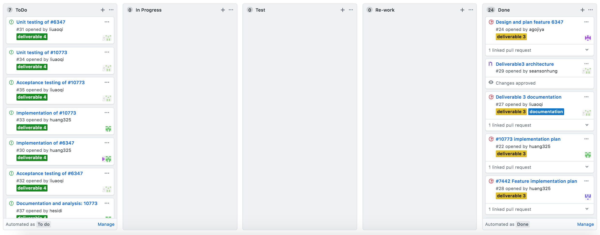
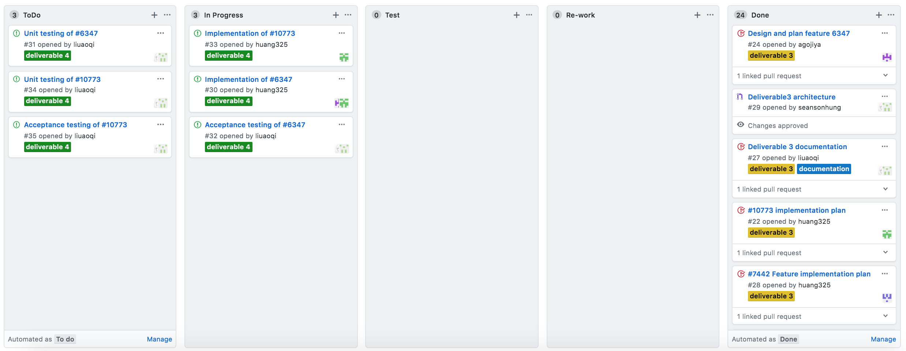

# Software Development Process

We have followed the Kanban software development process that we discussed in [Deliverable 1](../deliverable1/Project_Explanation.pdf) previously for this deliverable. This process consists of four phases.
1. **Gathering Issues**
2. **Analyzing** 
3. **Programming**
4. **Testing**
5. **Implementation**

We decided to use the Kanban board in Github to comprehensively and keep track of each member's progress. There were 5 processes in the column list we put in Kanban board, containing **ToDo, InProgress, Test, Re-work and Done**. Due to our project repository is private, therefore only contributors in this repository have access to project Kanban.

**ToDo** part contains the features/issues found by our teammates together (also with writing test cases/documentation). 

**InProgress** part contains each task every member need to deal with taken from ToDo list.

**Test** part contains the task that was almost completed and need to be tested in acurate level.

**Re-work** part contains the task which found was half-baked after going through testing, team member will re-start in this work.

**Done** part contains the task that was fully checked and tested well.

In this deliverable out team need to finish several missions: Each issue's analysis documentation (totally 3 issues), which is already done in deliverable 3. At least one big issue/feature completed with testing and implementing (pass the test cases and project provider's approve). For the chosen issues, teammate will work together to make the feature available in pdf.js. Testing and Implementation will take the majority of our work in this deliverable, also for some changes we made in documentation. 

## Gathering Issues

This step and **Analyzing** took us long time to complete, due to this part was done in previous deliverable 3. Each member in team got their own tasks: first we need to go through each features/issues in pdf.js and found the most interesting and high-level features to work on, then we still need to complete the documentation with analyzing the features' properties. Also, we have to draw the overal UML diagram for us to understand this project more, which could help us achieve the goal with deeper comprehensice and efficiency.

There were 3 features we choose to do deep analysis:

- Issue [6347](./deliverable3/6347.md)
- Issue [7442](./deliverable3/7442.md)
- Issue [10773](./deliverable3/10773.md)

#### Reason: 
The reason we choose these 3 selected issues to analysis is shown below.

1. For 6347, it's a quite useful and convenient function for users when they view file with pictures and if they wan tot save the picture from files.

2. For 7442, multiple words and sentences search is also making the features in pdf.js much more plentiful.

3. For 10773, adjust size of pdf file is usful for users when they try to fit the file with the proper browser and windows.

Each document of issues has details listed below:

- **Description**: Clear and detailed explanation of bugs from the feature list. The description will be shown in words or in pictures as well as any related events.

- **Location in Code**: The place/code line in file that features could be added.

- **Time Estimate**: Planned time that developers will take in fixing issues, doing testing and implementing. If the time is uncertain, it could be optional based on developers' plan.

- **Acceptance Testing**: Some test cases/acceptance tests used for testing the features' functions and any existing errors.

- **Implementation plan**: The implementation for the implemented features.

- **UML for the feature**: The detailed UML graghs to describe the structures of each feature's working place.

The screenshot of our team's Kanban board in this step is attached below.

## Analyzing

Each member already choose their own work and start to do the analyzing. Team members need to understand the location that issues come out inside of software structure and look at more detailed aspects to decribe features clearly. Also, they need to prepare the documentation of each features about detailed explanation.

Due to this time, the number of features we want to analysis and figure out was 3, therefore, there was no tasks that member will not able to finish. Due to Kanban's flexible principle, if one member feel that if some work need to be re-test or review again, he/she could put the task from **Done** to **InProgress** or **Re-work**

The screenshot of our team's Kanban board in this step is attached below.

## Programming

This part is the most important step in deliverable 4, our goal is to make the features we choose in previous deliverable bacome available for users in pdf.js. 

During the programming process, if members find out the soluction in completing the features, then they could do the actual changes in project's source code after creating a new branch dedicated to the fix. And in this time, it's fine that if one or two of our found features are not available for us to resolve, due to in deliverable 4, we only need to finish and implement at least one features to the project. This rule makes us be free to choose any doable issue/feature. 

**Attention** is that every changes will be made in their own local repository and there will be no effect to the master branch of project in Github.

The screenshot of our team's Kanban board in this step is attached below. 

## Testing

During the Testing process, we planed to design write and run test cases in both manual and automation method for higher accuracy. Here, we choose two of the chosen features to do the testing, which let us guarantee that we will have on feature completed and another one as best as possilbel. We need to come up with not only acceptance tests, but also unit tests to make sure the features working well in pdf.js. The **unit test** will be done in seperate branch in case of crashing code and will not have impact to other part. If some cases failed, then members have to put the task to Re-work list, which stands for double checking the code and do modification and optimization.

We carefully design **Unit Tests** so that each unit test is responsible for testing one core part of the feature. Each unit test cases will be checked by at least two of our teammates to make sure there are no mistakes when runing the tests.

The screenshot of our team's Kanban board in this step is attached below. 

## Implementation

During the Implementation process, we will first push changes to project's fork repsitory and link it with original issues when doing commit. 

For feature 6347, the creation of an image layer will allow images that are rendered on the canvas to also be contained in the image layer with the correct position and shape. Using the factory design pattern, the new image layer will also define a factory which will be responsible for defining the image layer builder. The image layer builder will need to create and handle rendering tasks.

For feature 10073, the implementation would be pretty similar as the existing parameter [zoom](https://github.com/CSCD01/pdf.js-team22/blob/4893b14a522f6aced286d7fd2f4c79dd2807f6f0/web/pdf_link_service.js#L243), which zoom the pdf with scale, left postion and top position.

The "view" we are going to implement is just the simple form of "zoom", that requires input scale and option left or top position.

The screenshot of our team's Kanban board in this step is attached below. 

