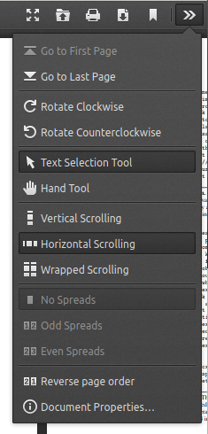

# [Issue 11154](https://github.com/mozilla/pdf.js/issues/11154)

Allow right-to-left horizontal scrolling

------------------------------------------------------

Labels: **1-ux**, **1-viewer**, **2-feature**

## Description

The feature request describes a modification to the horizontal scrolling feature. In the current version, the horizontal scrolling feature orders pages from left to right in increasing order. This is not friendly to all types of documents as the reporter describes by using CJK vertical text as an example. The feature to be added will allow horizontal scrolling to occur from right to left with flipped page order.

Page `N` which is currently displayed to the left of page `N+1` will now be displayed to the right of page `N+1`. The "start" of the document is therefore at the rightmost page instead of the leftmost. This fixes the issue for the example that the reporter used.

Although the reporter used horizontal scrolling as the example, it is not difficult to imagine that a similar feature may be requested in the future which asks for the same thing but in vertical scrolling mode. (ie: Page `N` is displayed below page `N+1`). Instead of cluttering the interface with an extra button or toggle which flips the mode of horizontal scrolling alone, it makes more sense to deal with this issue in both scrolling modes by adding a button or toggle to reverse the page order. This will automatically solve the issue related to this feature request for both scrolling modes.

## Location in code

The event hooks and handler is located in [web/app.js](https://github.com/CSCD01/pdf.js-team22/blob/11154/web/app.js). The handler toggles a boolean in [web/base_viewer.js](https://github.com/CSCD01/pdf.js-team22/blob/11154/web/base_viewer.js#L1312) which (after some checks) calls a function which reorders the pages in the PDF. Additionally, the HTML for the button is located in [web/viewer.html](https://github.com/CSCD01/pdf.js-team22/blob/11154/web/viewer.html#L199), the CSS is located in [web/viewer.css](https://github.com/CSCD01/pdf.js-team22/blob/11154/web/viewer.css#L1000), and JavaScript references to the button are located in [web/viewer.js](https://github.com/CSCD01/pdf.js-team22/blob/11154/web/viewer.js#L107) and [web/secondary_toolbar.js](https://github.com/CSCD01/pdf.js-team22/blob/11154/web/secondary_toolbar.js#L132). The icons for the button are located in [web/images](https://github.com/CSCD01/pdf.js-team22/tree/11154/web/images).

## Time estimate

10 hours

## Testing

We expect to see the pages in a PDF document displayed in reverse order when the button is pressed. We can manually verify this by loading any PDF document and attempting to reverse the page order in either scrolling mode.

Steps:
- Clone the repository with the changes
- Build according to the instructions on the README document
- Start the server to use the viewer locally
- Open a pdf (preferrably with multiple pages to see the changes)
- Observe the order of the pages, then choose "Reverse page order" from the dropdown menu
- Check that the order of the pages is now in reverse
- Check that this allows right-to-left scrolling in horizontal scrolling mode

## Implementation

The implementation adds a button to the dropdown menu on the web viewer. The style of implementation for the button is consistent with the implementation of existing buttons (ie: spread selectors). The buttons bind to the event bus which in turn allows the handler to toggle the page ordering with each event. Once a toggle occurs, a function designed to handle a change in the ordering mode is called which removes all pages from the document and inserts them back in the appropriate order. The method of removing all content and then inserting it back is already in use in the project by the spread selector buttons.

The modified files can be seen above in the **Locations in code** section.

The implementation passes all test cases and style checks (Lint).