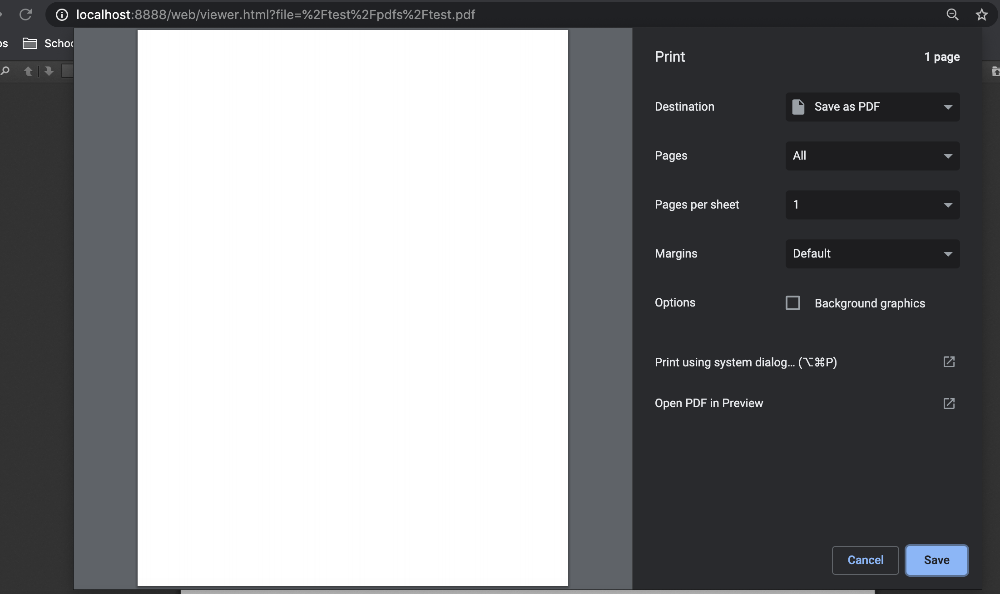

# [Issue 11259](https://github.com/mozilla/pdf.js/issues/11259)
Create an option to disable auto-printing.
----------------------------------------------------
Labels: **1-viewer**,  **2-feature**
## Description
The feature request describes an added parameter that disables the PDF auto-print function on load. The current behaviour is that a printing prompt pops up on load if the PDF contains javascript that sastifies this [`regex`](https://github.com/mozilla/pdf.js/blob/master/web/ui_utils.js#L59).

## Location in code
Currently the auto printing code resides in [app.js](https://github.com/mozilla/pdf.js/blob/master/web/app.js#L1229-L1257). The added option that we will use to disable/enable the auto printing code will be define in [app_options.js](https://github.com/mozilla/pdf.js/blob/master/web/app_options.js).

## Time Estimate
1 hour to implement and test.

## Testing
User Acceptance Tests:
To verify that the feature works as intended, the user should do the following.
1. Create a pdf and add `this.print({bUI: true,bSilent: false,bShrinkToFit: true});` to its javascript (via Acrobat reader pro).
2. Add the pdf to [/test/pdfs/](https://github.com/mozilla/pdf.js/tree/master/test/pdfs)
3. Start a local web server with this [guide](https://github.com/mozilla/pdf.js/) and open the PDF you just added.
4. Change the value of the app option disableAutoPrint and re-open the PDF.

As default, as soon as the PDF load, a print promp should pop up like this.

After changing the value of disableAutoPrint to true, the promp should not appear when reloading the PDF.

To ensure changes did not introduce any regression, run test cases and Lint following this [guide](https://github.com/mozilla/pdf.js/wiki/Contributing).

## Implementation
To complete this request, we implement it as an app-option that will be used to disable/enable the auto printing code. The default value of disableAutoPrint will be false as auto printing is still the default behaviour.
```
disableAutoPrint: {
    /** @type {boolean} */
    value: false,
    kind: OptionKind.VIEWER + OptionKind.PREFERENCE,
  },
```
By changing setting the disableAutoPrint option value to true, the hack that support auto printing will not be reach.
```
if (!AppOptions.get("disableAutoPrint")) {
    // Hack to support auto printing.
    for (const js of javaScript) {
        if (js && AutoPrintRegExp.test(js)) {
            setTimeout(function() {
                window.print();
            });
        return;
        }
    }
}
```
