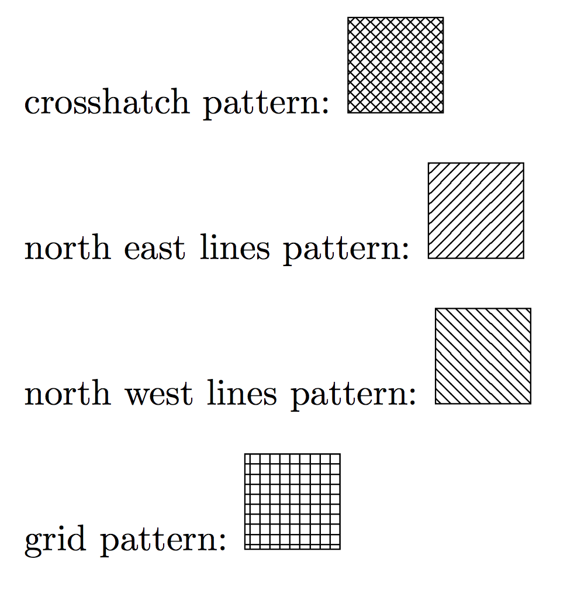
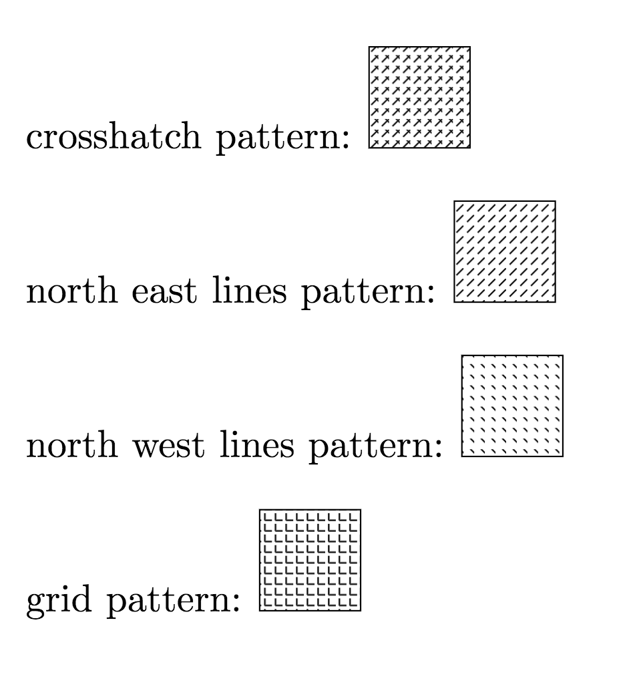

# [Issue 11473](https://github.com/mozilla/pdf.js/issues/11473)

Image pattern reprent with wrong pattern style.

----------------------------------------------------

Lable: **4-shading-pattern**.

## Description

The PDF file which is created by Tex Source Tool. And we found that in different pdf viwer(Chrome built-in viwer, Adobe pdf reader and pdf.js viwer), the diagrams are showed in differennt pattern.

For example: 

With the Tex source code:

```
\documentclass[a4paper,11pt]{scrartcl}
\usepackage{tikz}
\usetikzlibrary{patterns}

\begin{document}
crosshatch pattern:
\begin{tikzpicture}
\draw[draw=black, fill=black!10, pattern=crosshatch, pattern color=black] (0,0) rectangle (1,1);
\end{tikzpicture}
\\

north east lines pattern:
\begin{tikzpicture}
\draw[draw=black, fill=black!10, pattern=north east lines, pattern color=black] (0,0) rectangle (1,1);
\end{tikzpicture}
\\

north west lines pattern:
\begin{tikzpicture}
\draw[draw=black, fill=black!10, pattern=north west lines, pattern color=black] (0,0) rectangle (1,1);
\end{tikzpicture}
\\

grid pattern:
\begin{tikzpicture}
\draw[draw=black, fill=black!10, pattern=grid, pattern color=black] (0,0) rectangle (1,1);
\end{tikzpicture}
\end{document}
```

### Chrome built-in/Adobe Reader:



### PDF.js viewer:  


The crosshatch pattern is rendered by pdf.js using the wrong pattern style (the lines become arrows). 
The other pattern style have a broken redering (they all have disconnect line).


## Location in code

Check with related pattern issues previously happened, finally found that this is should be defined in `src/display/pattern_helper.js`. The extra pattern recognition part most is inside of pattern_helper.js. 

## Time Estimate

5 hours

## Proposed Fix Outline

Inside of MeshCanvas function, we should figure out that when it reads data from tex version pdf, the edges/lines' pattern should be reprented properly.
	`tmpCanvas = cachedCanvases.getCanvas(
        "mesh",
        paddedWidth,
        paddedHeight,
        false
      );`
We think need to have some changes in mesh images designing part.

`var data = tmpCtx.createImageData(width, height);`

If the changes help fix the bug successfully, user will see the graph pattern show in pdf.js as same as in Chrome built-in.
