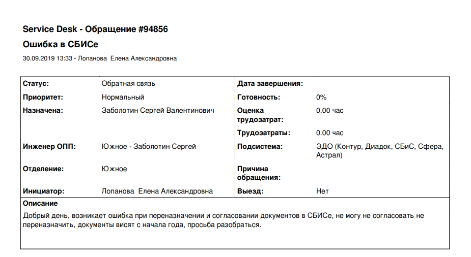
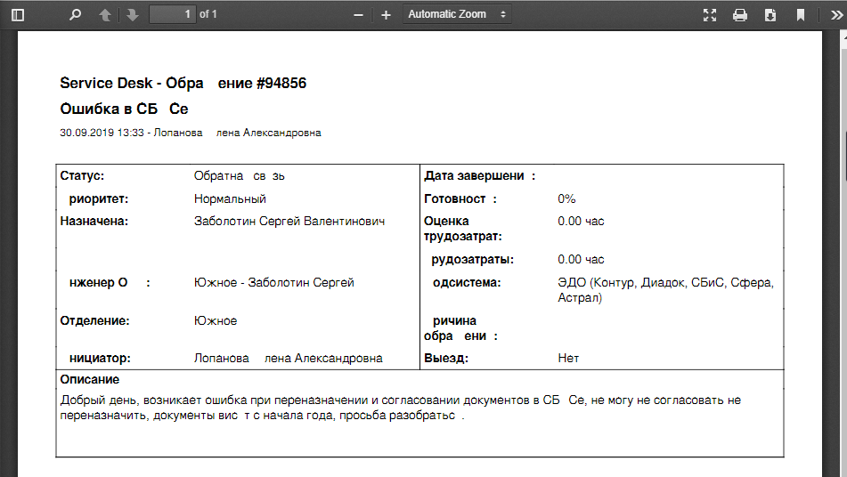
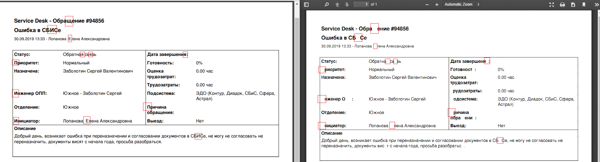
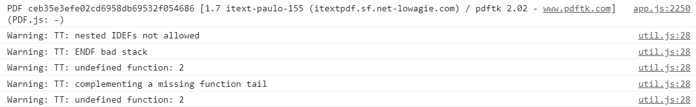

# [Issue 11561](https://github.com/mozilla/pdf.js/issues/11561)

## Some letters are not displayed

Labels: **4-font-conversion**.

## Description

Special letters are found not to display when files are opened in pdf viewer, which can be displayed in Chrome built-in PDF viewer and Adobe Reader. As shown in the example below:

### Chrome built-in/Adobe Reader:



### pdf.js viewer:



### Comparison:

In the image below, there are some letters missing in the screenshot on the right, which is how it is displayed in the pdf.js viewer. These letters are found to display in the Chrome built-in PDF viewer, as shown in the screenshot on the left.



## Location in code

The exceptions are with font conversion of complex characters that can be found in `src/core/fonts.js`.
In the console of pdf.js running on the given example file:



The warnings for `nested IDEFs not allowed` and `ENDF bad stack` are printed from `src/core/fonts.js` in functions `sanitizeTTProgram`, following by `undefined function: 2` when `checkInvalidFunctions` is called to validate the context in `santitizeTTPrograms` function, with the source code:

### [sanitizeTTProgram](https://github.com/CSCD01/pdf.js-team22/blob/af8d0b9597ccd0e020910eafd74dd6ad140db520/src/core/fonts.js#L2255)
```
      function sanitizeTTProgram(table, ttContext) {
        var data = table.data;
        var i = 0,
          j,
          n,
          b,
          funcId,
          pc,
          lastEndf = 0,
          lastDeff = 0;
        var stack = [];
        var callstack = [];
        var functionsCalled = [];
        var tooComplexToFollowFunctions = ttContext.tooComplexToFollowFunctions;
        var inFDEF = false,
          ifLevel = 0,
          inELSE = 0;
        for (var ii = data.length; i < ii; ) {
          var op = data[i++];
          // The TrueType instruction set docs can be found at
          // https://developer.apple.com/fonts/TTRefMan/RM05/Chap5.html
          if (op === 0x40) { ...
          } else if (op === 0x41) { ...
          } else if ((op & 0xf8) === 0xb0) { ...
          } else if ((op & 0xf8) === 0xb8) { ...
          } else if (op === 0x2b && !tooComplexToFollowFunctions) { ...
          } else if (op === 0x2c && !tooComplexToFollowFunctions) { ...
          } else if (op === 0x2d) {
            // ENDF - end of function
            if (inFDEF) {
              inFDEF = false;
              lastEndf = i;
            } else {
              pc = callstack.pop();
              if (!pc) {
                warn("TT: ENDF bad stack");
                ttContext.hintsValid = false;
                return;
              }
              funcId = functionsCalled.pop();
              data = pc.data;
              i = pc.i;
              ttContext.functionsStackDeltas[funcId] =
                stack.length - pc.stackTop;
            }
          } else if (op === 0x89) {
            // IDEF - instruction definition
            if (inFDEF || inELSE) {
              debugger;
              warn("TT: nested IDEFs not allowed");
              tooComplexToFollowFunctions = true;
            }
            inFDEF = true;
            // recording it as a function to track ENDF
            lastDeff = i;
          } else if (op === 0x58) { ...
          } else if (op === 0x1b) { ...
          } else if (op === 0x59) { ...
          } else if (op === 0x1c) { ...
          }
          // Adjusting stack not extactly, but just enough to get function id
          if (!inFDEF && !inELSE) { ...
          }
        }
        ttContext.tooComplexToFollowFunctions = tooComplexToFollowFunctions;
        var content = [data];
        if (i > data.length) { ...
        }
        if (lastDeff > lastEndf) { ...
        }
        foldTTTable(table, content);
      }

```

### [sanitizeTTPrograms](https://github.com/CSCD01/pdf.js-team22/blob/af8d0b9597ccd0e020910eafd74dd6ad140db520/src/core/fonts.js#L2496)

```
      function sanitizeTTPrograms(fpgm, prep, cvt, maxFunctionDefs) {
        var ttContext = {
          functionsDefined: [],
          functionsUsed: [],
          functionsStackDeltas: [],
          tooComplexToFollowFunctions: false,
          hintsValid: true,
        };
        if (fpgm) {
          sanitizeTTProgram(fpgm, ttContext);
        }
        if (prep) {
          sanitizeTTProgram(prep, ttContext);
        }
        if (fpgm) {
          checkInvalidFunctions(ttContext, maxFunctionDefs);
        }
        if (cvt && cvt.length & 1) {
          var cvtData = new Uint8Array(cvt.length + 1);
          cvtData.set(cvt.data);
          cvt.data = cvtData;
        }
        return ttContext.hintsValid;
      }

```


## Time Estimate

6 hours

## Proposed Fix Outline

This exception is caused by incorrect handling of complex or unexpected characters in `fonts.js`. `sanitizedTTPrograms` is called to render the characters from the reference font tables, where the characters are recognized as `tooComplexToFollowFunctions` when the original font data is modified following the code. This is expected to be fixed by improving the font sanitizer to handle particular charactesr in non-embedded font families.