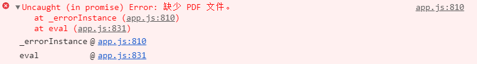
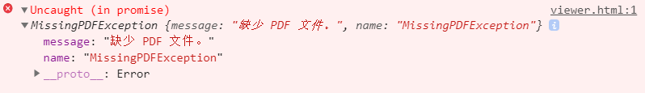

# [Issue 11658](https://github.com/mozilla/pdf.js/issues/11658)

Preserve error types (e.g. InvalidPDFException, MissingPDFException)

----------------------------------------------------

Labels: **1-viewer**

## Description
By preserving the exception type, more fine-grained error handling could be performed via client-side logic (e.g. redirect to a search page if a PDF is not found, or to a ticket system in case of invalid PDF files).

Apparently, the error message translation in app.js always throws a generic Error instead of re-throwing with the same exception class of the previous exception.
```
Uncaught (in promise) Error: Missing PDF file.
```


Changing the exception class should be BC compatible, as the custom exceptions such as MissingPDFException extend BaseException, which in turn uses the generic Error as prototype.
```
Uncaught (in promise) MissingPDFException: Missing PDF file.
```

## Location in code
The preserved exceptions are originally defined in [shared/util.js](https://github.com/CSCD01/pdf.js-team22/blob/c95b9b1e1721f4fa790e93c81ed0c8f62683a22c/src/shared/util.js#L407-L454). Then it is exported from [src/pdf.js](https://github.com/CSCD01/pdf.js-team22/blob/c95b9b1e1721f4fa790e93c81ed0c8f62683a22c/src/pdf.js#L99-L100) to be used by [app.js](https://github.com/CSCD01/pdf.js-team22/blob/c95b9b1e1721f4fa790e93c81ed0c8f62683a22c/web/app.js#L780-L818) on web.


## Time Estimate
5 hours

## Testing
We expect to see the preserved exception type when the PDF is invalid. The original testing structure is not able to auto test it. Firstly, this does not affect any view, so it's not detectable by reference images test. Secondly, the unit test is not able to catch this as it directly throw to the outside(e.g. browser).

However, we can still manually verify this by checking the console of browser. The expecting result would be like below.




## Implementation
The [update](https://github.com/CSCD01/pdf.js-team22/blob/28c72ff96160e326a9eb99d298e06a25bffca53e/web/app.js#L787-L832) is to set a handler to throw error instead of simple Error type.
```
let _errorInstance = function(msg) {
    return new Error(msg);
}

return loadingErrorMessage.then(msg => {
    this.error(msg, { message });
    throw _errorInstance(msg);
});
```
Then reset the exception type to be preserved when needed, such as 
```
_errorInstance = function(msg) {
    return new MissingPDFException(msg);
};
```
Then exception catched on browser can be differanciated by preserved types.

All test cases and Lint passed following [guide](https://github.com/mozilla/pdf.js/wiki/Contributing)