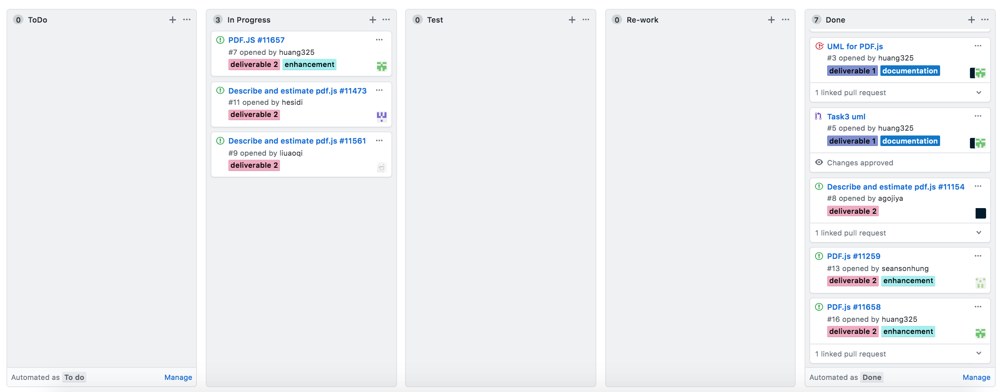

# Software Development Process

We have followed the Kanban software development process that we described in the deliverable 1 as we are finishing this deliverable. This process includes four steps.
1. **Gathering Issues**
2. **Analyzing** 
3. **Programming**
4. **Testing**
5. **Implementation**

We decided to use the Kanban board in Github to comprehensively and keep track of each member's progress. There were 5 processes in the column list we put in Kanban board, containing **ToDo, InProgress, Test, Re-work and Done**. Due to our project repository is private, therefore only contributors in this repository have access to project Kanban.

**ToDo** part contains the issues(bugs) found by our teammates together. 

**InProgress** part contains each task every member want to deal with taken from ToDo list.

**Test** part contains the task that was almost completed and need to be tested in acurate level.

**Re-work** part contains the task which found was half-baked after going through testing, team member will re-start in this work.

**Done** part contains the task that was fully checked and tested well.

In this deliverable out team need to finish several missions: Each issue's analysis documentation (totally 5 issues), At least two bugs fixed with testing and implementing. For those fixed issues, they will have extra cards about **Testing** and **Implementing**. 

## Gathering Issues

Each member in team will have two days in figuring out which issues to work on in pdf.js and vote for the top 5 issues to focus on through Messenger. We set the Kanban's maximum open issues to 5 which is also matched requirements of deliverable 2.

There were five issues in total. 

#### Document only: 
- Issue [11473](./11473.md)
- Issue [11561](./11561.md)
	       
#### Full Process: 
- Issue [11658](./11658.md)
- Issue [11154](./11154.md)
- Issue [11259](./11259.md)

Each document of issues has details listed below:

- **Description**: Clear and detailed explanation of bugs from the issue list. The problem will be shown in words or in pictures as well as any related events.

- **Location in Code**: The place/code line in file that cause bugs appeared. Or any function in file that got error messages. 

- **Time Estimate**: Planned time that developers will take in fixing issues, doing testing and implementing. If the time is uncertain, it could be optional based on developers' plan.

- **Proposed Implementation**: The implementation for the implemented issue or a possible fix for the issue.

The screenshot of our team's Kanban board in this step is attached below.

## Analyzing

During the Analyzing process, each member will pick their own task to work on and this process is the most time consuming part.Team members need to understand the location that issues come out inside of software structure and look at more detailed aspects to decribe problem clearly. At the same time, members need to layout the outline in how to fix the bugs.

In this period, one of our teammates found that the issue he took is to complicated with complishing in few days, based on Kanban's principle in flexibility, he could change to work on another task instead of previous one. This helped members become much more flexible in adapting ability with suitable tasks.

Due to the **InProgress** is the combination of the documentation writting and bug fix coding, when members finish either of them, they need to mark an update in task's description in order to inform other teammtes for awareness.

The screenshot of our team's Kanban board in this step is attached below. **(Issue Changes: 11657 --> 11658)**

Update:

## Programming

During the programming process, if members find out the soluction in dealing with issues, then they could do the actual changes in project's source code after creating a new branch dedicated to the fix. 

**Attention** is that every changes will be made in their own local repository and there will be no effect to the master branch of project in Github.

## Testing

During the Testing process, we planed to design write and run test cases in both manual and automation method for higher accuracy. The **unit test** will be done in seperate branch in case of crashing code and will not have impact to other part. If some cases failed, then members have to put the task to Re-work list, which stands for double checking the code and do modification and optimization.

The screenshot of our team's Kanban board in this step is attached below. 

## Implementation

During the Implementation process, we will first push changes to project's fork repsitory and link it with original issues when doing commit. We will use Lint JS file to get proper result and if all cases pass, which means we are good in this bug fixing. Running test cases provided by PDF.js guide to check our changes do not create regression error. After passing the project's CI and make a pull request to central repository. Then the pull request will be pending to be reviewed by project's owner(team).

The screenshot of our team's Kanban board in this step is attached below. 

