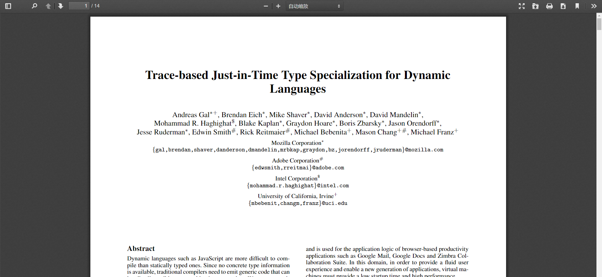
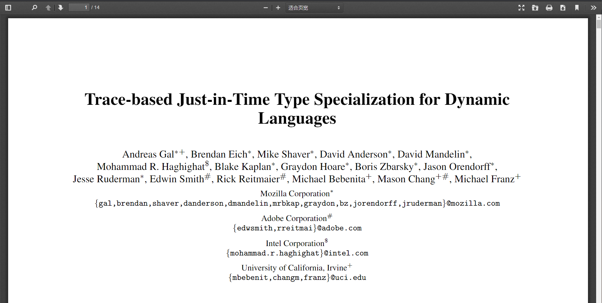

# [Issue 10773](https://github.com/mozilla/pdf.js/issues/10773)

missing support for "view" parameter in URL fragment identifiers

----------------------------------------------------

Labels: **1-viewer**, **2-feature**

## Description
Add support for "view" parameter for opening PDF files on web following [Adobe Acrobat SDk](https://www.adobe.com/content/dam/acom/en/devnet/acrobat/pdfs/pdf_open_parameters_v9.pdf#page=6) documentation. This parameter would set the view of the displayed page, using the keyword values defined in the PDF language specification. On the web, it's going to be a query parameter in URL such as "view=Fit". Based on the value, default view will be set as fitting horizontal or vertical with mention space between edge.


## Location in code
These feature is going to be implemented under [web/pdf_link_service.fs](https://github.com/CSCD01/pdf.js-team22/blob/4893b14a522f6aced286d7fd2f4c79dd2807f6f0/web/pdf_link_service.js#L224-L333). This is where the query parameters are handled.


## Time Estimate
8 hours

## Acceptance Testing
We except to see the default view of pdf changed base on the parameter pass in. This can be tested by running web part locally with gulp server. To verify, For example, by nevigate below url from browser
```
http://localhost:8888/web/viewer.html?file=%2Ftest%2Fpdfs%2Ftracemonkey.pdf
```

Current we are going to see above with default setting, but after implementation, we can show below with view parameter. For example, when fitting horizontally,
```
http://localhost:8888/web/viewer.html?file=%2Ftest%2Fpdfs%2Ftracemonkey.pdf#page=1&view=FitH
```

We would see the above same pdf is fitted by width by default.


## Implementation plan
The implementation would be pretty similar as the existing parameter [zoom](https://github.com/CSCD01/pdf.js-team22/blob/4893b14a522f6aced286d7fd2f4c79dd2807f6f0/web/pdf_link_service.js#L243), which zoom the pdf with scale, left postion and top position.

The "view" we are going to implement is just the simple form of "zoom", that requires input scale and option left or top position.

To avoid creating duplication, the "view" implementation will also set and pass through [dest](https://github.com/CSCD01/pdf.js-team22/blob/4893b14a522f6aced286d7fd2f4c79dd2807f6f0/web/pdf_link_service.js#L296) as the way "zoom" had. Then the [scrollPageIntoView in web/base_viewer.js](https://github.com/CSCD01/pdf.js-team22/blob/4893b14a522f6aced286d7fd2f4c79dd2807f6f0/web/base_viewer.js#L754) is going to handle the rest staff base on the feeded parameters.

The code changes only needed under web/pdf_link_service.js. The whole path of this new feature will share those used by zoom originally. Here we just make an allowance on view, as it's included in Adobe doc, and convert it to the corresponding zoom properties.

