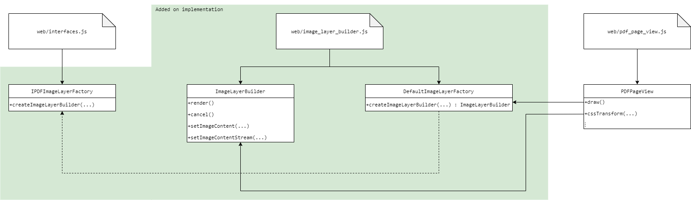

 # [Feature 6347](https://github.com/mozilla/pdf.js/issues/6347)

Ability to copy images within the PDF document

----------------------------------------------------

Labels: **2-feature**

## Description
Add the ability to handle images within a PDF document as if they were images in a pure HTML document in the browser. This will automatically add the ability to copy the image following the standard in modern browsers. An alternative, more lightweight solution was proposed in the comments under the issue which essentially implements a screenshot tool within the canvas view. This is not a good idea because it will force the resolution of the copied image to be dependent on the resolution of the device that it is being viewed on. Additionally, such tools already exist which allow users to take screenshots of any part of their screen.

## Location in code
This feature requires the creation of an image layer factory in order to be consistent with the design of the exising text layer factory. The interface will be in [web/interfaces.js](https://github.com/CSCD01/pdf.js-team22/blob/master/web/interfaces.js#L140-L159), which will be implemented inside `web/image_layer_builder.js` (new file). The factory and builder will be referenced inside [web/pdf_page_view.js](https://github.com/CSCD01/pdf.js-team22/blob/master/web/pdf_page_view.js#L434-L455), similar to the way that [web/text_layer_builder.js](https://github.com/CSCD01/pdf.js-team22/blob/master/web/text_layer_builder.js#L438-L465) is referenced.

## Time Estimate
15 hours

## Acceptance testing
Before:
- Open a PDF document which contains an image in the viewer
- Right click the mouse within the image bounds
- Notice the lack of a "Copy image" option as well as a lack of the usual options provided for images by modern browsers

After:
- Open a PDF document which contains an image in the viewer
- Right click the mouse within the image bounds
- Notice that the usual context menu options for images provided by modern browsers are present, including the "Copy image" option

## Implementation plan
Each page in the web view contains a canvas layer within which the document is actually rendered. Additionally, there are other layers which may be present. The most common of which is the text layer which includes `span` representations of text that is in the page. The location of these `span` elements is such that they are placed exactly above the text rendered on the canvas and have the same shape, but are transparent (to hide discrepancies). This allows users to select the text within the document which is not possible if the document is rendered in the canvas alone.

The implementation for this feature will work in a similar way. The creation of an image layer will allow images that are rendered on the canvas to also be contained in the image layer with the correct position and shape. Since the image layer will contain actual image objects, browsers will offer the same context menu options (including "Copy image") for them as they do for images on other web pages.

Using the factory design pattern which is also used for the text layer, the new image layer will also define a factory which will be responsible for defining the image layer builder. The image layer builder will need to create and handle rendering tasks (similar to the text layer). Additionally, the layer must also react to CSS transforms of the document (ie: rotation), this will be handled the same way that the text layer handles it which is in [web/pdf_page_view.js](https://github.com/CSCD01/pdf.js-team22/blob/master/web/pdf_page_view.js#L331-L382).

## UML

