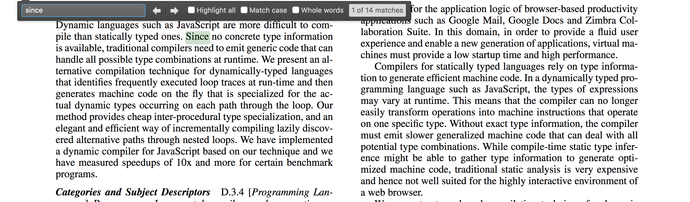
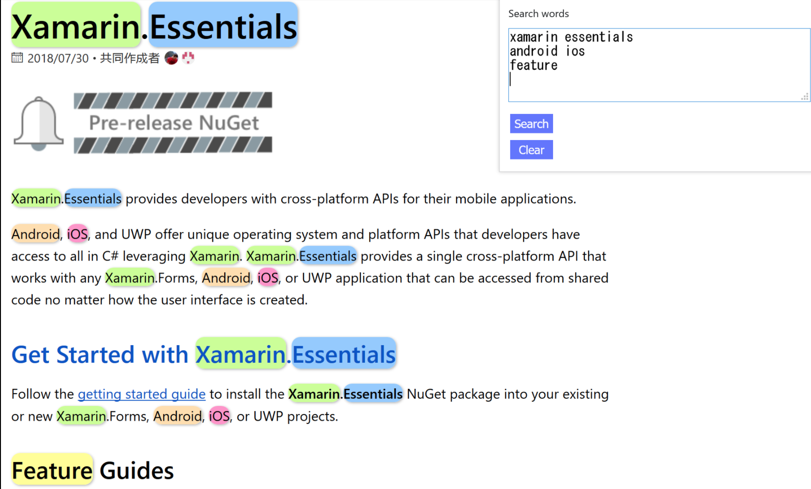
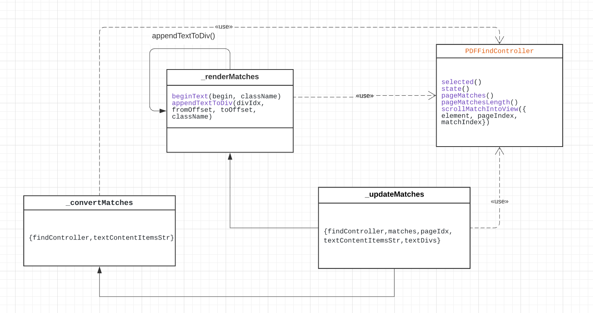

# [Feature 7442](https://github.com/mozilla/pdf.js/issues/7442)

Search PDF for phrases and terms simultaneously

----------------------------------------------------

Labels: **4-text-selection**, **2-feature**

## Description
In the example [viewer](https://mozilla.github.io/pdf.js/web/viewer.html)
This PDF viwer doesn't have the ability to highlight multiple search terms and phrases which is available to use before in [#5496](https://github.com/mozilla/pdf.js/pull/5496). The feature is about that if users search multiplr different sentences in searching bar, the realated phrases should be found and hilighted.

## Location in code
The feature is considered should be implemented in the file [web/text_layer_builder.js](https://github.com/mozilla/pdf.js/blob/master/web/text_layer_builder.js#L219-L359). 

## Time Estimate
10 hours

## Acceptance Testing
We are wxcepting to make the multiple search feature working when usrs open pdf file in viewer. This could be tested by giving a query string in an array (#search = ["p1", "p2", "w1"]) and take a look at viwer to see if there is hilight and founder or not locally. 

For example, previously when users do single search the screenshot will be like:

And what the desired function we are looking for (borrow from other website: https://addons.mozilla.org/en-US/firefox/addon/search-and-highlight/#&gid=1&pid=1):

users could search multiple terms at one time and all result will be hilighted)

## Implementation plan

If users do a new search, then [_updateMatches](https://github.com/mozilla/pdf.js/blob/master/web/text_layer_builder.js#L219-L321) is called at [_renderMatches](https://github.com/mozilla/pdf.js/blob/master/web/text_layer_builder.js#L323-L358) which clears all existing matches at ame place. If we need this behavior to be different, we may do some changes here. In order to read each parameter in a search query, we are planning to change query into JSON type, whcih much more easier for us to match words. Seperate long sentences into small pieces and then to do the search in whole file. 

Using [PDFFindController](https://github.com/mozilla/pdf.js/blob/master/web/pdf_find_controller.js) to get match terms and make it hilight.

And based on previous commenter's suggestions, we may also try another method which is do changes in PDFLinkService as well. 

## UML

