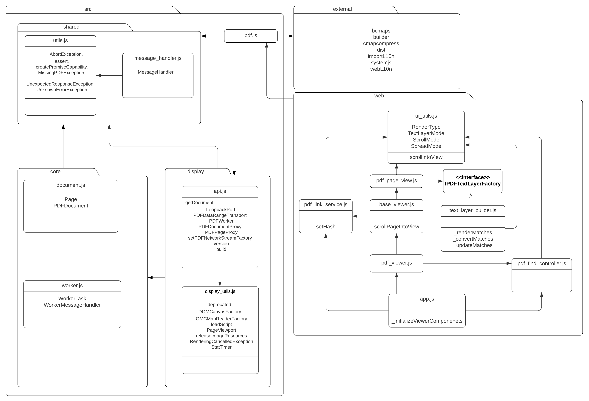

# PDF.js Overall Architecture
PDF.js is structured such that there is a clear division of subtasks. These divisions, named core, display and viewer, are layered such that each layer provides information/services to the next layer.

## Layered Architecture
The layered architecture organizes components into layers, where each layer has one specific responsibility in the application. This architecture results in each layer being highly cohesive with minimal coupling.

### Core Layer
The core layer is responsible for interpreting and parsing binary PDF contents, which is the foundation for which all subsequent layers are built on.

### Display Layer
The display layer takes information sent from the core layer and uses API to render PDF and also get other information out of the PDF.

### Viewer Layer
The view layer is built on the display layer and constructs the UI for the PDF viewer. It supports a variety of features, such as searching, rotating, printing...etc

----------------------------------------------------

## Design Pattern and Principles

### Factory Design Pattern
Factory Design Pattern is used throughout the application. For example: 
- [class PDFFunctionFactory](https://github.com/CSCD01/pdf.js-team22/blob/4893b14a522f6aced286d7fd2f4c79dd2807f6f0/src/core/function.js#L26) in `src/core/function.js` creates any `PDFFunction` that is used in multiple `core` files, such as functions in `image.js` taking `pdfFunctionFactory` for [building images](https://github.com/CSCD01/pdf.js-team22/blob/4893b14a522f6aced286d7fd2f4c79dd2807f6f0/src/core/image.js#L99).
- In `src/core/annotation.js` and `src/display/annotation_layer.js` the class called AnnotationFactory can create any type of annotation.
- In `src/display/annotation_layer.js` the class called [AnnotationElementFactory](https://github.com/CSCD01/pdf.js-team22/blob/4893b14a522f6aced286d7fd2f4c79dd2807f6f0/src/display/annotation_layer.js#L47) can create any type of annotation element.

### DRY (Don't Repeat Yourself) Principle
For example: `/share` folder holds constants and functions shared between the core and viewer layer.

