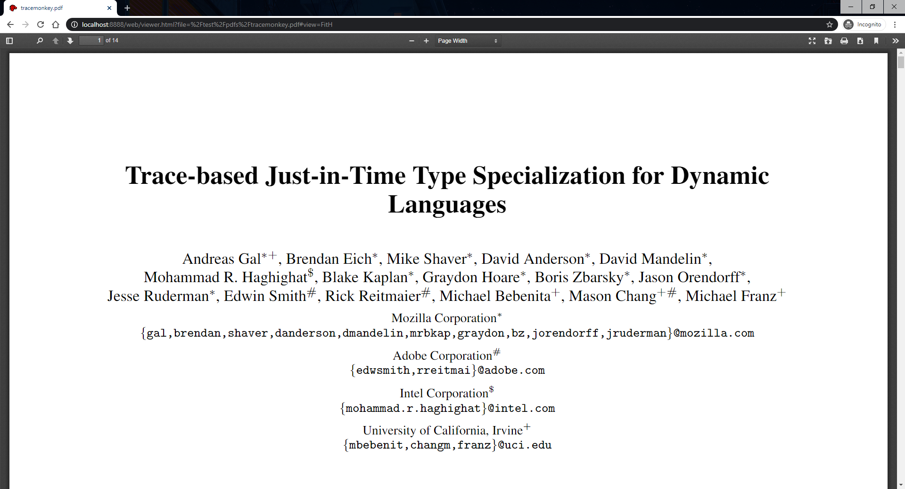
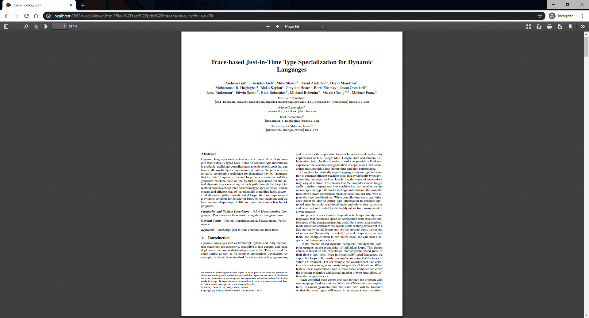
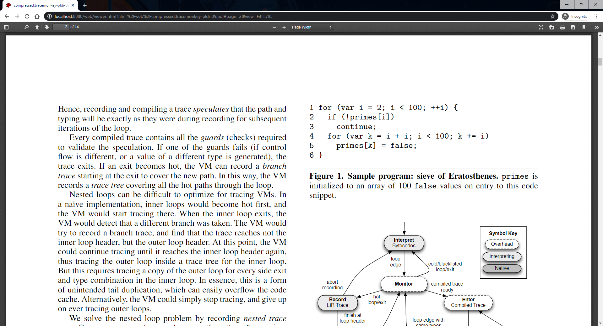
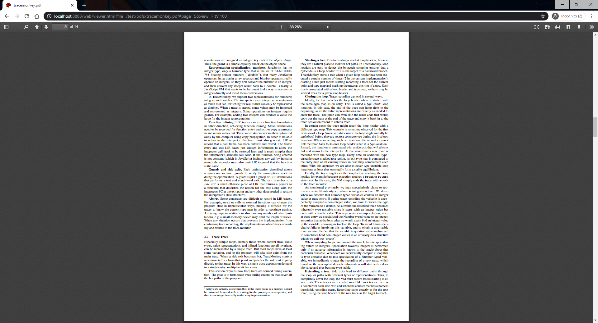
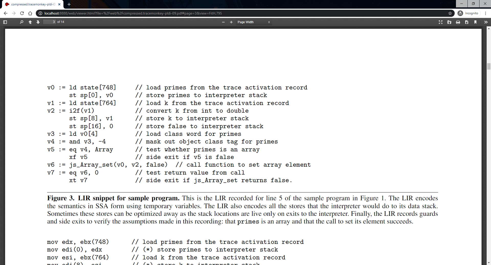

# [Feature 10773](https://github.com/mozilla/pdf.js/issues/10773)

Changing of mode of view by adding "view" parameter in URL.

## Expected Behaviour
1. Append view parameter to the URL.
2. Reload the page, the PDF is rendered with specified view.

----------------------------------------------------

## Acceptance Testing
### Setting up:

Step 1: Clone the repository with the changes

Step 2: Build according to the instructions on the README document

Step 3: Start the server to use the viewer locally using `gulp server`

Step 4: Open the testing PDF file found under `test/pdfs`, as an example the following link is used:
```
http://localhost:8888/web/viewer.html?file=%2Ftest%2Fpdfs%2Ftracemonkey.pdf
```

Step 5: Observe the PDF is rendered to the first page with the default view 'Automatic Zoom'


### 1. Fit parameter
#### a. Fit horizontally

Step 1: Append Fit parameter, `#view=FitH,100`, to the URL and reload

Step 2: Observe the PDF is rendered to Fit horizontally with the page width



#### b. Fit vertically

Step 1: Change the Fit parameter in the URL into `#view=FitV` and reload

Step 2: Observe the PDF is rendered to fit vertically


#### c. Fit to page 

Step 1: Change the Fit parameter in the URL into `#view=Fit` and reload

Step 2: Observe the PDF is rendered to fit to page



### 2. Fit to a specific page with fit parameter

When rendering to specifc pages, having mentioned in [issue #2843](https://github.com/mozilla/pdf.js/issues/2843), the zoom parameters are not correctly implemented and need to be set to specific values for the page to display correctly, therefore, zoom parameters are also used in these cases.

#### a. Fit to a specific page horizontally

Step 1: Change the Fit parameter in the URL into `#page=2&view=FitH,975` and reload

Step 2: Observe the PDF is rendered to page 2 and fit horizontally



#### b. Fit to a specific page vertically

Step 1: Change the Fit parameter in the URL into `#page=5&view=FitV,100` and reload

Step 2: Observe the PDF is rendered to page 5 and fit vertically



### 3. Fit to a specific page with set parameter when opening the PDF

#### a. Fit horizontally

Step 1: Close the previously opened test file

Step 2: Re-open the test file with a fit parameter in the URL, such as
```
http://localhost:8888/web/viewer.html?file=%2Fweb%2Fcompressed.tracemonkey-pldi-09.pdf#page=3&view=FitH,795
```

Step 3: Observe the PDF is rendered to page 3 and fit horizontally



#### b. Fit vertically

Step 1: Close the previously opened test file

Step 2: Re-open the test file for fitting vertically with the fit parameter in the URL:
```
http://localhost:8888/web/viewer.html?file=%2Ftest%2Fpdfs%2Frotation.pdf#page=2&view=FitV
```

Step 3: Observe the PDF is rendered to page 2 and fit vertically


