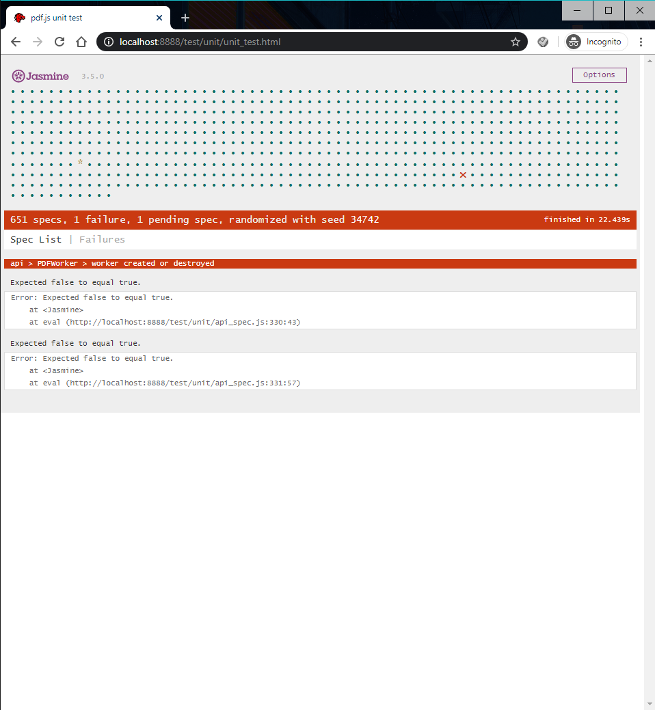

# Unit Testing Instructions

The unit test is done using testing framework jasmine, which is located in `test/unit/jasmine-boot.js` and modified for loading PDF.js libraries.

### Step 1

Clone the repository with the changes

### Step 2

Build according to the instructions on the README document

### Step 3

Start the server to use the viewer locally by using `gulp server`

### Step 4

Run the unit tests using the following link:
```
http://localhost:8888/test/unit/unit_test.html
```
The result of all unit tests will be displyed on the page, with green dot indicating passing and red cross mark indicating failures, as shown in the screenshot.

