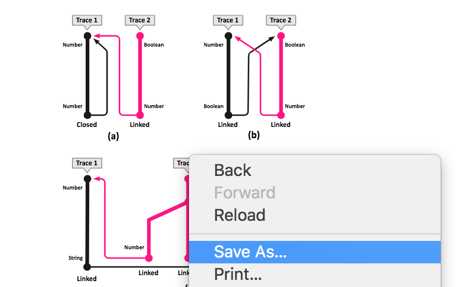

# Feature

[6347](https://github.com/CSCD01/team_22-project/blob/Documentaion_process/doc/deliverable3/6347.md)

This is our initial choice for deliverable 4. As we see many people commentted this would be an useful feature.

## Description

Copying image:

1. move mouse cursor over image in pdf
2. press the right mouse button OR double click left mouse button
3. option to copy image displayed in dropdown menu OR CTRL+C

Copying a selection of an image

1. move mouse cursor over image
2. press and hold the left mouse button
3. drag the mouse cursor until desired part of the image is highlighted
4. right click and select copy image OR press CTRL+C
5. open external image editor and paste selection of image

Add the ability to handle images within a PDF document as if they were images in a pure HTML document in the browser. This will automatically add the ability to copy the image following the standard in modern browsers.

## Design of Code

## User Guide

When viewing a pdf file, users can move their mouse to some pictures inside of the file and right click to save the chosen file. Or click the chosen picture, and users could copy and paste pictures as well.

## Reason we stop working on this
We spent great amount of time investigating the potential solution for this feature. As showed in UML, we choose to follow the same structure like how text was handled previously. In [text_layer.js](https://github.com/CSCD01/pdf.js-team22/blob/4fe92605b75d7e0952738b7f1575d78145b69aeb/src/display/text_layer.js#L626-L652), it gets each text sections along with their metadata by loading from a stream buffer from [api.js](https://github.com/mozilla/pdf.js/blob/9871ccc69fca8478dbebd80a9a18591410c4b3d0/src/display/api.js#L1187). However the whole idea for images are different and there isn't an existing method we can invoke similar as texts. Overall, the changes are too significant and there are too much new contents need to be implemented and tested here. Thus, we decided to switch to implement [#10773](./Documentaion_10773.md) due to limited amount of time for this deliverable.
