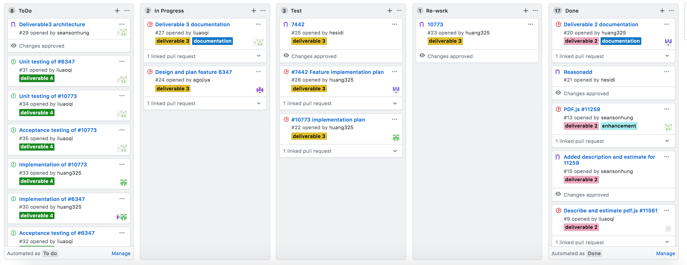

# Software Development Process

We have followed the Kanban software development process that we discussed in [Deliverable 1](../deliverable1/Project_Explanation.pdf) previously for this deliverable. This process consists of four phases.
1. **Gathering Issues**
2. **Analyzing** 
3. **Programming**
4. **Testing**
5. **Implementation**

We decided to use the Kanban board in Github to comprehensively and keep track of each member's progress. There were 5 processes in the column list we put in Kanban board, containing **ToDo, InProgress, Test, Re-work and Done**. Due to our project repository is private, therefore only contributors in this repository have access to project Kanban.

**ToDo** part contains the features/issues found by our teammates together (also with writing test cases/documentation). 

**InProgress** part contains each task every member need to deal with taken from ToDo list.

**Test** part contains the task that was almost completed and need to be tested in acurate level.

**Re-work** part contains the task which found was half-baked after going through testing, team member will re-start in this work.

**Done** part contains the task that was fully checked and tested well.

In this deliverable out team need to finish several missions: Each issue's analysis documentation (totally 3 issues), which is already done in deliverable 3. At least one big issue/feature completed with testing and implementing (pass the test cases and project provider's approve). For the chosen issues, teammate will work together to make the feature available in pdf.js. Testing and Implementation will take the majority of our work in this deliverable, also for some changes we made in documentation. 


## Gathering Issues

This step and **Analyzing** took us long time to complete, due to this part was done in previous deliverable 3. Each member in team got their own tasks: first we need to go through each features/issues in pdf.js and found the most interesting and high-level features to work on, then we still need to complete the documentation with analyzing the features' properties. Also, we have to draw the overal UML diagram for us to understand this project more, which could help us achieve the goal with deeper comprehensice and efficiency.

### Meeting

Our team usually have meetings in Messenger twice a week, including texting and voice discussing. In the meeting, we decided the method to find issues/features to work on in pdf.js issues list (where the lable tag is [2-feature](https://github.com/mozilla/pdf.js/issues?q=is%3Aopen+is%3Aissue+label%3A2-feature))

We choose the most recent 30 issues related to feature tag in list to review. Each member will have 12 issues to tae a look at in total, which means every two members will have 6 issues that is duplicated with each other. This reviewing way makes sure that each issues will be evaluated by two people in case od misunderstand. After reviewing, each member will need to come up with two issus that best fit to our goal, the our team will vote for the best 3 issues in the selected 10 issues.

### Result

There were 3 features we choose to do deep analysis:

- Issue [6347](https://github.com/CSCD01/team_22-project/blob/master/doc/deliverable3/6347.md)
- Issue [7442](https://github.com/CSCD01/team_22-project/blob/master/doc/deliverable3/7442.md)
- Issue [10773](https://github.com/CSCD01/team_22-project/blob/master/doc/deliverable3/10773.md)

#### Reason: 
The reason we choose these 3 selected issues to analysis is shown below.

1. For 6347, it's a quite useful and convenient function for users when they view file with pictures and if they wan tot save the picture from files.

2. For 7442, multiple words and sentences search is also making the features in pdf.js much more plentiful.

3. For 10773, adjust size of pdf file is usful for users when they try to fit the file with the proper browser and windows.


Each document of issues has details listed below:

- **Description**: Clear and detailed explanation of bugs from the feature list. The description will be shown in words or in pictures as well as any related events.

- **Location in Code**: The place/code line in file that features could be added.

- **Time Estimate**: Planned time that developers will take in fixing issues, doing testing and implementing. If the time is uncertain, it could be optional based on developers' plan.

- **Acceptance Testing**: Some test cases/acceptance tests used for testing the features' functions and any existing errors.

- **Implementation plan**: The implementation for the implemented features.

- **UML for the feature**: The detailed UML graghs to describe the structures of each feature's working place.

The screenshot of our team's Kanban board in this step is attached below.


## Analyzing

Each member already choose their own work and start to do the analyzing. Team members need to understand the location that issues come out inside of software structure and look at more detailed aspects to decribe features clearly. Also, they need to prepare the documentation of each features about detailed explanation.

Due to this time, the number of features we want to analysis and figure out was 3, therefore, there was no tasks that member will not able to finish. Due to Kanban's flexible principle, if one member feel that if some work need to be re-test or review again, he/she could put the task from **Done** to **InProgress** or **Re-work**

The screenshot of our team's Kanban board in this step is attached below.





## Programming

This part is the most important step in deliverable 4, our goal is to make the features we choose in previous deliverable bacome available for users in pdf.js. 

During the programming process, if members find out the soluction in completing the features, then they could do the actual changes in project's source code after creating a new branch dedicated to the fix. And in this time, it's fine that if one or two of our found features are not available for us to resolve, due to in deliverable 4, we only need to finish and implement at least one features to the project. This rule makes us be free to choose any doable issue/feature. 

### Meeting

So in this part, our team also did a vote in weekly meeting to decide which feature to select in next processing part. As a result, we picked feature 6347 and 10773 to continue. Due to those are based on factory design pattern and high-level enough for our team to complete.

**Attention** is that every changes will be made in their own local repository and there will be no effect to the master branch of project in Github.

The screenshot of our team's Kanban board in this step is attached below. 


## Testing

During the Testing process, we planed to design write and run test cases in both manual and automation method for higher accuracy. Here, we choose two of the chosen features to do the testing, which let us guarantee that we will have on feature completed and another one as best as possilbel. We need to come up with not only acceptance tests, but also unit tests to make sure the features working well in pdf.js. The **unit test** will be done in seperate branch in case of crashing code and will not have impact to other part. If some cases failed, then members have to put the task to Re-work list, which stands for double checking the code and do modification and optimization.

We carefully design **Unit Tests** so that each unit test is responsible for testing one core part of the feature. Each unit test cases will be checked by at least two of our teammates to make sure there are no mistakes when runing the tests.


The screenshot of our team's Kanban board in this step is attached below. 


## Implementation

During the Implementation process, we will first push changes to project's fork repsitory and link it with original issues when doing commit. 

For feature 6347, the creation of an image layer will allow images that are rendered on the canvas to also be contained in the image layer with the correct position and shape. Using the factory design pattern, the new image layer will also define a factory which will be responsible for defining the image layer builder. The image layer builder will need to create and handle rendering tasks.

For feature 10073, the implementation would be pretty similar as the existing parameter [zoom](https://github.com/CSCD01/pdf.js-team22/blob/4893b14a522f6aced286d7fd2f4c79dd2807f6f0/web/pdf_link_service.js#L243), which zoom the pdf with scale, left postion and top position.

The "view" we are going to implement is just the simple form of "zoom", that requires input scale and option left or top position.

The screenshot of our team's Kanban board in this step is attached below. 


# Feature 6347

[6347](https://github.com/CSCD01/team_22-project/blob/master/doc/deliverable3/6347.md)

This is our initial choice for deliverable 4. As we see many people commentted this would be an useful feature.

## Description

Copying image:

1. move mouse cursor over image in pdf
2. press the right mouse button OR double click left mouse button
3. option to copy image displayed in dropdown menu OR CTRL+C

Copying a selection of an image

1. move mouse cursor over image
2. press and hold the left mouse button
3. drag the mouse cursor until desired part of the image is highlighted
4. right click and select copy image OR press CTRL+C
5. open external image editor and paste selection of image

Add the ability to handle images within a PDF document as if they were images in a pure HTML document in the browser. This will automatically add the ability to copy the image following the standard in modern browsers.

## Design of Code


## User Guide

When viewing a pdf file, users can move their mouse to some pictures inside of the file and right click to save the chosen file. Or click the chosen picture, and users could copy and paste pictures as well.


## Reason we stop working on this
We spent great amount of time investigating the potential solution for this feature. As showed in UML, we choose to follow the same structure like how text was handled previously. In [text_layer.js](https://github.com/CSCD01/pdf.js-team22/blob/4fe92605b75d7e0952738b7f1575d78145b69aeb/src/display/text_layer.js#L626-L652), it gets each text sections along with their metadata by loading from a stream buffer from [api.js](https://github.com/mozilla/pdf.js/blob/9871ccc69fca8478dbebd80a9a18591410c4b3d0/src/display/api.js#L1187). However the whole idea for images are different and there isn't an existing method we can invoke similar as texts. Overall, the changes are too significant and there are too much new contents need to be implemented and tested here. Thus, we decided to switch to implement [#10773](./Documentaion_10773.md) due to limited amount of time for this deliverable.


# Feature 10773

[10773](https://github.com/CSCD01/team_22-project/blob/master/doc/deliverable3/10773.md)

We switched to this feature after [#6347](./Documentaion_6347.md). We also tried to fix a related issue related to this feature [#2843](https://github.com/mozilla/pdf.js/issues/2843) during implementation.

## Description

### 10773
```
view=Fit
view=FitH
view=FitH,top
view=FitV
view=FitV,left
view=FitB
view=FitBH
view=FitBH,top
view=FitBV
view=FitBV,left
```

Set the view of the displayed page, using the keyword values defined in the PDF language specification. Scroll values left and top are floats or integers in a coordinate system where 0,0 represents the top left corner of the visible page, regardless of document rotation.

Steps to get the problem:

1. Check out the repository, run npm install and gulp server, then navigate the viewer to a PDF that isn't automatically zoomed in to fill your viewport width on viewer initialization (http://localhost:8888/web/viewer.html?file=%2Ftest%2Fpdfs%2Ftracemonkey.pdf works for me).
2. Append #page=1&view=FitH to the URL in the address bar, and reload the page.

Currently, the view parameter in PDF URL fragment identifiers is currently unsupported.

What we did is that, add support for "view" parameter for opening PDF files on web following Adobe Acrobat SDk documentation. This parameter would set the view of the displayed page, using the keyword values defined in the PDF language specification. 

### 2843
According to the open parameter specification, [link](http://www.adobe.com/content/dam/Adobe/en/devnet/acrobat/pdfs/pdf_open_parameters_v9.pdf#page=6), the zoom parameter should be implemented as: `zoom=scale,left,top`, with the interpretation:

> Scroll values _left_ and _top_ are in a coordinate system where 0,0 which represents the top left corner of the visible page, regardless of document rotation.

This is not the case in pdf.js, which is a problem if you try opening the following:
http://mozilla.github.io/pdf.js/web/viewer.html#page=2&zoom=auto,0,0

* Expected result: The document should open at the top of page 2, as it does with Adobe Reader.
* What actually happens: The document is scrolled down to the top of page 3.
 
The problem seems to be that in pdf.js, the origin in the coordinate system (the one that is exposed to the user) is placed at the bottom left corner. From what I've gathered, pdf.js internally uses a coordinate system placed at the top left corner of the page, so I don't know why it's not working.
I'm not so familiar with this part of the codebase, but could be the issue here:
https://github.com/mozilla/pdf.js/blob/master/src/util.js#L390


## Design in Code


## Implementation

The related [Pull Request](https://github.com/mozilla/pdf.js/pull/11786) is created.

### 10773

In [web/pdf_link_service.js](https://github.com/mozilla/pdf.js/blob/master/web/pdf_link_service.js)

add code inside of `setHash` function:

```
      if ("view" in params) {
        const viewArgs = params.view.split(","); // scale,left/top
        const viewArg = viewArgs[0];

        if (viewArg === "Fit" || viewArg === "FitB") {
          dest = [null, { name: viewArg }];
        } else if (
          viewArg === "FitH" ||
          viewArg === "FitBH" ||
          viewArg === "FitV" ||
          viewArg === "FitBV"
        ) {
          dest = [
            null,
            { name: viewArg },
            viewArgs.length > 1 ? viewArgs[1] | 0 : null,
          ];
        } else {
          console.error(
            `PDFLinkService.setHash: "${viewArg}" is not ` +
              "a valid view value."
          );
        }
      }
```
This aims at build the destination array and make the view of the displayed page available in function, which is similar way as the [zoom](https://github.com/CSCD01/pdf.js-team22/blob/4893b14a522f6aced286d7fd2f4c79dd2807f6f0/web/pdf_link_service.js#L243):

```
      if ("zoom" in params) {
        // Build the destination array.
        const zoomArgs = params.zoom.split(","); // scale,left,top
        const zoomArg = zoomArgs[0];
        const zoomArgNumber = parseFloat(zoomArg);

        if (!zoomArg.includes("Fit")) {
          // If the zoomArg is a number, it has to get divided by 100. If it's
          // a string, it should stay as it is.
          dest = [
            null,
            { name: "XYZ" },
            zoomArgs.length > 1 ? zoomArgs[1] | 0 : null,
            zoomArgs.length > 2 ? zoomArgs[2] | 0 : null,
            zoomArgNumber ? zoomArgNumber / 100 : zoomArg,
          ];
        } else {
          if (zoomArg === "Fit" || zoomArg === "FitB") {
            dest = [null, { name: zoomArg }];
          } else if (
            zoomArg === "FitH" ||
            zoomArg === "FitBH" ||
            zoomArg === "FitV" ||
            zoomArg === "FitBV"
          ) {
            dest = [
              null,
              { name: zoomArg },
              zoomArgs.length > 1 ? zoomArgs[1] | 0 : null,
            ];
          } else if (zoomArg === "FitR") {
            if (zoomArgs.length !== 5) {
              console.error(
                'PDFLinkService.setHash: Not enough parameters for "FitR".'
              );
            } else {
              dest = [
                null,
                { name: zoomArg },
                zoomArgs[1] | 0,
                zoomArgs[2] | 0,
                zoomArgs[3] | 0,
                zoomArgs[4] | 0,
              ];
            }
          } else {
            console.error(
              `PDFLinkService.setHash: "${zoomArg}" is not ` +
                "a valid zoom value."
            );
          }
        }
      }
```
And here, we also delete the duplicate part in zoom, based on project advisors' suggestion. Then previous FitV, FitH etc. passing through `zoom` is now going through `view` in url.
```
    if (zoomArg === "Fit" || zoomArg === "FitB") {
      dest = [null, { name: zoomArg }];
    } else if (
      zoomArg === "FitH" ||
      zoomArg === "FitBH" ||
      zoomArg === "FitV" ||
      zoomArg === "FitBV"
    ) {
      dest = [
        null,
        { name: zoomArg },
        zoomArgs.length > 1 ? zoomArgs[1] | 0 : null,
      ];
    } 
```

Regardless of #2843, the feature for #10773 is now fixed. It meets the PDF standard and the user can set up view to change default fit pattern on web.

### 2843
After tons of testing, we find out the issue is in `base_viewer.js` it's [converting](https://github.com/mozilla/pdf.js/blob/4fe92605b75d7e0952738b7f1575d78145b69aeb/web/base_viewer.js#L885-L890) input points to a from-top-left point.
```
    const boundingRect = [
      pageView.viewport.convertToViewportPoint(x, y),
      pageView.viewport.convertToViewportPoint(x + width, y + height),
    ];
    let left = Math.min(boundingRect[0][0], boundingRect[1][0]);
    let top = Math.min(boundingRect[0][1], boundingRect[1][1]);
```
Thus, the input value we passed from `pdf_link_service.js` is supposed to be a from-botton-left point. However, from the user point, their input is actually a from-top-left value. Due to that, there is an extra conversion and massed up the position value.

As discussed in [comment](https://github.com/mozilla/pdf.js/issues/10773#issuecomment-610183217), we initially decided to apply and addtional conversion in `base_viewer.js` to make all the position value from-botton-left. But this was rejected by the reviewer, who said this way would affact other part of project so it's not safe and elegent enough. We think that's an reasonable rejection and we accept it.

After that, the other solution we can think about is to have another wrapper out side [base_viewer.js/scrollPageIntoView](https://github.com/mozilla/pdf.js/blob/4fe92605b75d7e0952738b7f1575d78145b69aeb/web/base_viewer.js#L774) to be use by `zoom` and `view` only, but that's still not elegent enough.

We are still keeping track with the reviewer to get suggestions on what we can do to make this fixed.

## Acceptance Testing
We expect to see the default view of pdf changed base on the parameter pass in. This can be tested by running web part locally with gulp server. To verify, for example, by navigating through the url below from browser:
```
http://localhost:8888/web/viewer.html?file=%2Ftest%2Fpdfs%2Ftracemonkey.pdf
```

Currently we are going to see above with default setting, but after implementation, we can show below with the view parameter. For example, when fitting horizontally,
```
http://localhost:8888/web/viewer.html?file=%2Ftest%2Fpdfs%2Ftracemonkey.pdf#page=1&view=FitH
```

We would see above the same pdf is fitted by width by default.

## User Guide

After the implementation is done, we will have options in url such as append `#page=1&view=FitV,100` to fit the page vertically with 100px from top.


# Acceptance Test of [Feature 10773](https://github.com/mozilla/pdf.js/issues/10773)

Changing mode of view by adding "view" parameter in URL.

## Expected Behaviour
1. Append view parameter to the URL.
2. Reload the page, the PDF is rendered with specified view.

----------------------------------------------------

## Acceptance Testing

### Setting up:

Step 1: Clone the repository with the changes

Step 2: Build according to the instructions on the README document

Step 3: Start the server to use the viewer locally by using `gulp server`

Step 4: Open the testing PDF file found under `test/pdfs`, as an example, the following link is used:
```
http://localhost:8888/web/viewer.html?file=%2Ftest%2Fpdfs%2Ftracemonkey.pdf
```

Step 5: Observe the PDF is rendered to the first page with the default view 'Automatic Zoom'


### 1. Fit parameter

#### a. Fit horizontally

Step 1: Append Fit parameter, `#view=FitH,100`, to the URL and reload

Step 2: Observe the PDF is rendered to Fit horizontally with the page width


#### b. Fit vertically

Step 1: Change the Fit parameter in the URL into `#view=FitV` and reload

Step 2: Observe the PDF is rendered to fit vertically


#### c. Fit to page 

Step 1: Change the Fit parameter in the URL into `#view=Fit` and reload

Step 2: Observe the PDF is rendered to fit to page


### 2. Fit to a specific page with fit parameter

When rendering to specifc pages, that mentioned in [issue #2843](https://github.com/mozilla/pdf.js/issues/2843), the zoom parameters are not correctly implemented and need to be set to specific values for the page to display correctly, therefore, zoom parameters are also used in these cases.

#### a. Fit to a specific page horizontally

Step 1: Change the Fit parameter in the URL into `#page=2&view=FitH,975` and reload

Step 2: Observe the PDF is rendered to page 2 and fit horizontally


#### b. Fit to a specific page vertically

Step 1: Change the Fit parameter in the URL into `#page=5&view=FitV,100` and reload

Step 2: Observe the PDF is rendered to page 5 and fit vertically


### 3. Fit to a specific page with set parameter when opening the PDF

#### a. Fit horizontally

Step 1: Close the previously opened test file

Step 2: Re-open the test file with a fit parameter in the URL, such as
```
http://localhost:8888/web/viewer.html?file=%2Fweb%2Fcompressed.tracemonkey-pldi-09.pdf#page=3&view=FitH,795
```

Step 3: Observe the PDF is rendered to page 3 and fit horizontally


#### b. Fit vertically

Step 1: Close the previously opened test file

Step 2: Re-open the test file for fitting vertically with the fit parameter in the URL:
```
http://localhost:8888/web/viewer.html?file=%2Ftest%2Fpdfs%2Frotation.pdf#page=2&view=FitV
```

Step 3: Observe the PDF is rendered to page 2 and fit vertically


